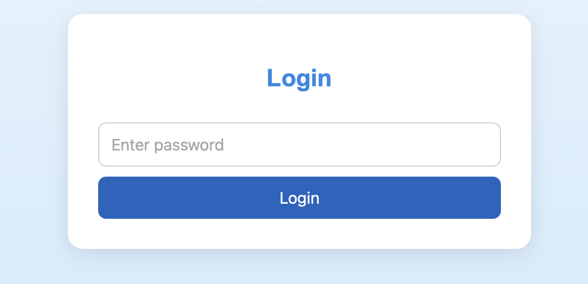
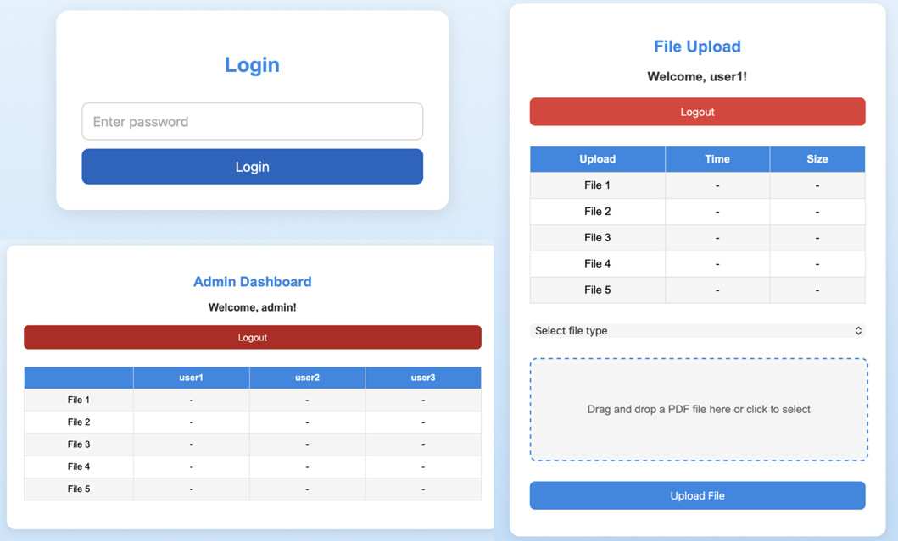

Create a website for managing class assignments:

- Run the python script on a list of students/users
- Get the php site along with the credentials generated for admin and users
- Upload the files in a webserver, as instructed below.

[Demo](http://barmpalias.net/share/index.php)

### Instructions

1. **Edit `PWD_PATH`**:
   - In `loginGen.py`, replace `/home/user/secure/pwd.txt` with the absolute path where you want to store `pwd.txt` (e.g., `/home/yourusername/secure/pwd.txt`).
   - Ensure the directory exists and is outside `public_html` (e.g., `mkdir /home/yourusername/secure`).

2. **Run the Script**:
   - Create `info.txt` with one user ID per line (e.g., `user1`, `user2`).
   - Run: `python loginGen.py k info.txt` (e.g., `python loginGen.py 5 info.txt`).
   - This generates `pwd.txt` and `index.php` in the current directory.

3. **Move `pwd.txt`**:
   - Move `pwd.txt` to the secure location: `mv pwd.txt /home/yourusername/secure/pwd.txt`.
   - Set permissions: `chmod 644 /home/yourusername/secure/pwd.txt`.
   - Ensure the web server user (e.g., `www-data` or `apache`) has read access to the file and directory.

4. **Deploy Files**:
   - Place `index.php` and `logout.php` (from previous responses) in your web server directory (e.g., `public_html/share/websites/php-login`).
   - Set directory permissions for uploads: `chmod 777 public_html/share/websites/php-login` (adjust for security later).

5. **Verify Security**:
   - Since `pwd.txt` is outside `public_html`, it’s inaccessible via the web.
   - Optionally, confirm the parent directory (e.g., `/home/yourusername/secure`) has restrictive permissions (e.g., `chmod 700 /home/yourusername/secure`) to limit access to the owner.

6. **Test**:
   - Access the login page and test with passwords from `pwd.txt`.
   - Ensure the admin dashboard and user upload pages work as expected, with no errors reading `pwd.txt`.

### Notes

- **Path Accuracy**: The `PWD_PATH` must be an absolute path accessible to the PHP process. If you’re unsure of the correct path, check your server’s home directory structure or consult your hosting provider.
- **Permissions**: The web server user needs read access to `pwd.txt`. If you encounter file access errors, verify permissions and ownership (e.g., `chown www-data:www-data /home/yourusername/secure/pwd.txt` if `www-data` is the web server user).
- **No `.htaccess` Needed**: Since `pwd.txt` is outside `public_html`, you don’t need a `.htaccess` file to block access, enhancing security.
- **Backup `pwd.txt`**: Store a copy of `pwd.txt` securely, as it contains all user passwords.
